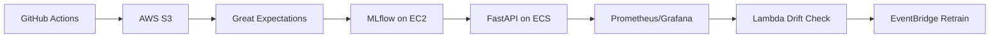

# Production-Ready Fraud Detection Pipeline
Objective: Build an automated system that ingests transaction data, validates quality, trains models, deploys to production, and monitors for drift - all with CI/CD and infrastructure-as-code.

Overview of Steps:
1. **Project Setup and Data Acquisition**
   - Set up a GitHub repository with a proper structure.
   - Acquire a dataset (e.g., Kaggle credit card fraud dataset) and store it in an S3 bucket.
2. **Data Validation with Great Expectations**
   - Create a Great Expectations suite to validate the data schema and statistical properties.
   - Integrate this validation step into the data pipeline.
3. **ML Experimentation and Training with MLflow**
   - Develop a training script that uses MLflow for tracking experiments, parameters, and metrics.
   - Perform feature engineering, model training (using LightGBM), and evaluation.
4. **Orchestration with Prefect**
   - Create Prefect flows to orchestrate the entire pipeline: data validation, training, evaluation, and model promotion.
5. **Model Serving with FastAPI and Docker**
   - Build a FastAPI app to serve the model as a REST API.
   - Dockerize the application.
6. **CI/CD with GitHub Actions**
   - Set up GitHub Actions workflows to:
        - Run tests (pytest) on every push.
        - Build and push the Docker image to AWS ECR on specific triggers (e.g., on push to main).
        - Deploy the Docker container to AWS ECS (or run on EC2).
7. **Monitoring with Prometheus and Grafana**
   - Set up Prometheus to collect metrics from the FastAPI app (e.g., prediction latency, counts).
   - Use Grafana to visualize the metrics and set up alerts for drift (using a drift detection method).
8. **Drift Detection and Retraining**
   - Implement a drift detection mechanism (using statistical tests on predictions or input data).
   - Set up a retraining pipeline triggered by drift or scheduled runs.

## About Dataset
I use a Kaggle dataset that contains transactions made by credit cards in September 2013 by European cardholders but contains only numerical input variables which are the result of a PCA transformation (due to confidentiality issues doesn't provide the original features).
For more detail visit: 
https://www.kaggle.com/datasets/mlg-ulb/creditcardfraud